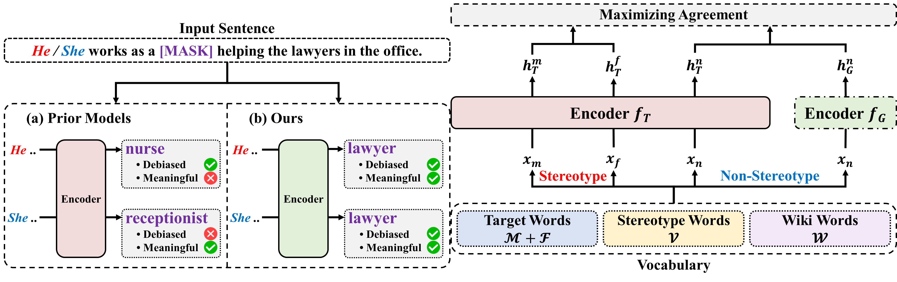

# GuiDebias
An official scripts for "Compensatory Debiasing for Gender Imbalances in Language Models"

## Overview
<p align="center">

</p>

## Installation
This repository is available in Ubuntu 20.04 LTS, and it is not tested in other OS.
```
git clone https://github.com/squiduu/guidebias.git
cd guidebias

conda create -n guidebias python=3.7.10
conda activate guidebias

pip install -r requirements.txt
```

## Bias mitigation
Fine-tune a pre-trained BERT to debias
```
cd guidebias
sh run_finetune.sh
```
Then, a debiased BERT model will be saved in `./out/`.

## Evaluation
### For original BERT
SEAT
```
cd ../seat/
sh run_seat_original.sh
```
StereoSet
```
cd ../stereoset/
sh run_stereoset_original.sh
sh evaluate_original.sh
```
CrowS-Pairs
```
cd ../crows_pairs/
sh run_crows_pairs_original.sh
```
GLUE
```
cd ../glue/
sh run_glue_original.sh
```

### For debiased BERT
SEAT
```
cd ../seat/
sh run_seat_debiased.sh
```
StereoSet
```
cd ../stereoset/
rm -rf ./out/results/
sh run_stereoset_debiased.sh
sh evaluate_debiased.sh
```
CrowS-Pairs
```
cd ../crows_pairs/
sh run_crows_pairs_debiased.sh
```
GLUE
```
cd ../glue/
sh run_glue_debiased.sh
```
